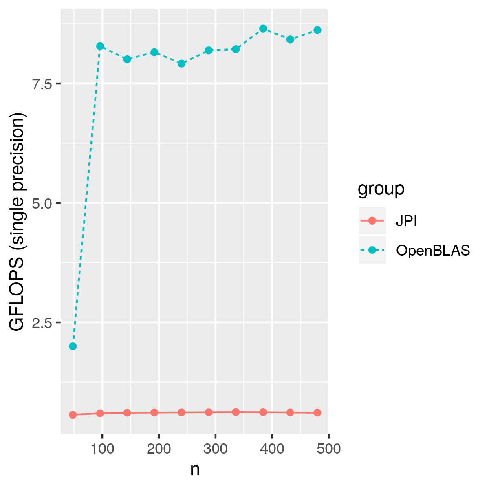

Last week I got a Raspberry Pi from one friend, and I am thinking about doing something with this little board.

First, let's check the CPU spec by `cat /proc/cpuinfo`.

```
processor	: 0
model name	: ARMv7 Processor rev 4 (v7l)
BogoMIPS	: 38.40
Features	: half thumb fastmult vfp edsp neon vfpv3 tls vfpv4 idiva idivt vfpd32 lpae evtstrm crc32 
CPU implementer	: 0x41
CPU architecture: 7
CPU variant	: 0x0
CPU part	: 0xd03
CPU revision	: 4
```


We can see the `neon` feture, which is similar with SSE on x86 CPUs.
Suddenly, I remembered a MOOC I took before: 
[LAFF-On Programming for High Performance](http://www.cs.utexas.edu/users/flame/laff/pfhp/).
It is a really fun MOOC, Prof. Robert van de Geijn leads the student from
a naive implementation of GEMM to a very efficient one.
The course is built for Intel CPUs, because you need to use AVX instruction for speed.
Since we have NEON support on  Raspberry Pi,
let's see how good the performance we can get on this little board following a similar method.
It is a good opportunity to learn more about NEON and ARM.

## Checking the NEON support

The following is a small piece of code using neon, you can find more example from [here](https://github.com/thenifty/neon-guide).
To compile the code, I used the gcc options from 
[RetroPie](https://github.com/RetroPie/RetroPie-Setup/blob/master/scriptmodules/system.sh#L312),
which is a game emulation.
Please try it on your own board to see if it works.


```c
#include <arm_neon.h>

int main() {
  float32x4_t v1 = {1.0, 2.0, 3.0, 4.0}, v2 = {5.0, 6.0, 7.0, 8.0},
              v3 = {4.0, 3.0, 2.0, 1.0};
  float32x4_t acc = vmlaq_f32(v3, v1, v2);  // acc = v3 + v1 * v2
  float values[4];
  vst1q_f32(values, acc);  // values = {9.0, 15.0, 23.0, 33.0};
}
```

## OpenBLAS as a reference implementation

I am using OpenBLAS as a reference for correctness and speed, although I don't think I can achieve a similar performance with OpenBLAS.

You can download the source code from their [github repo](https://github.com/xianyi/OpenBLAS), and


```
make TARGET=ARMV7
```

## Loop ordering

Let's start from the simplest method for GEMM, three nested loops.

<p></p>

Due to memory cache, different loop ordering can have quite different performance as shown below.

<p></p>

It is clear that JPI and PJI loop orderings have better performance.
JPI loop has the best performance,
because in each execution of the inner loop of the JPI ordering updates the same column of C.
 
But we are way slower than our OpenBLAS reference.

<p></p>
