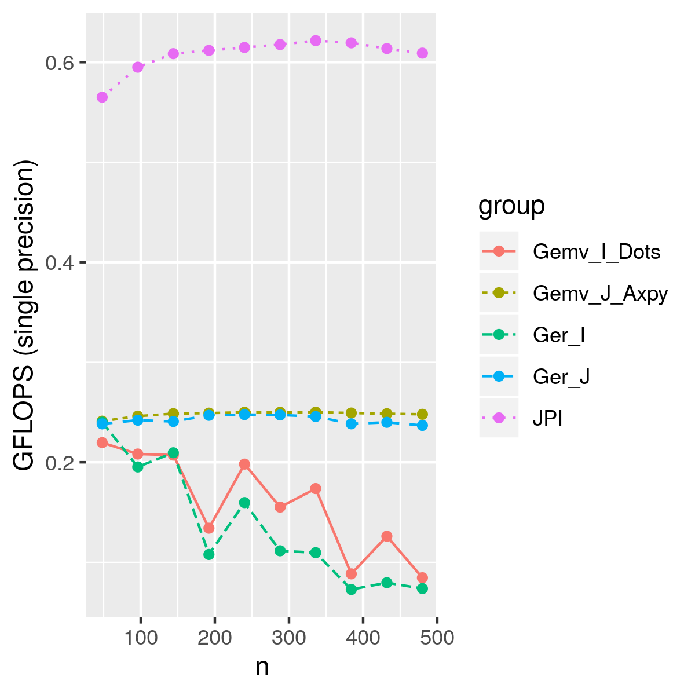

Besides the nested loop, there are alternative ways to compute GEMM.

## GEMM using GEMV

GEMM can be computed using GEMV as shown below.

## GEMM using rank-1 update (GER)

GEMM can also be viewed as a series of rank-1 update (GER) operations.

## Performance

If we don't use GEMV or GER from a good BLAS and just use a naive loop,
the performance can be even worse than our JPI loop.

