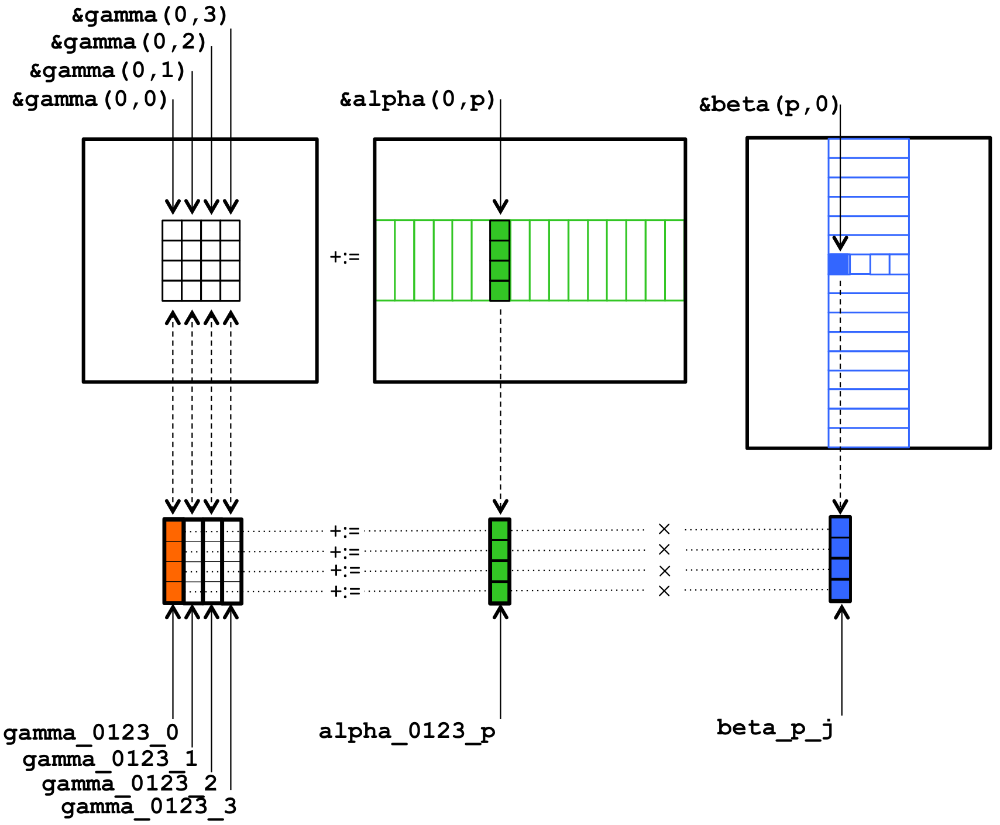
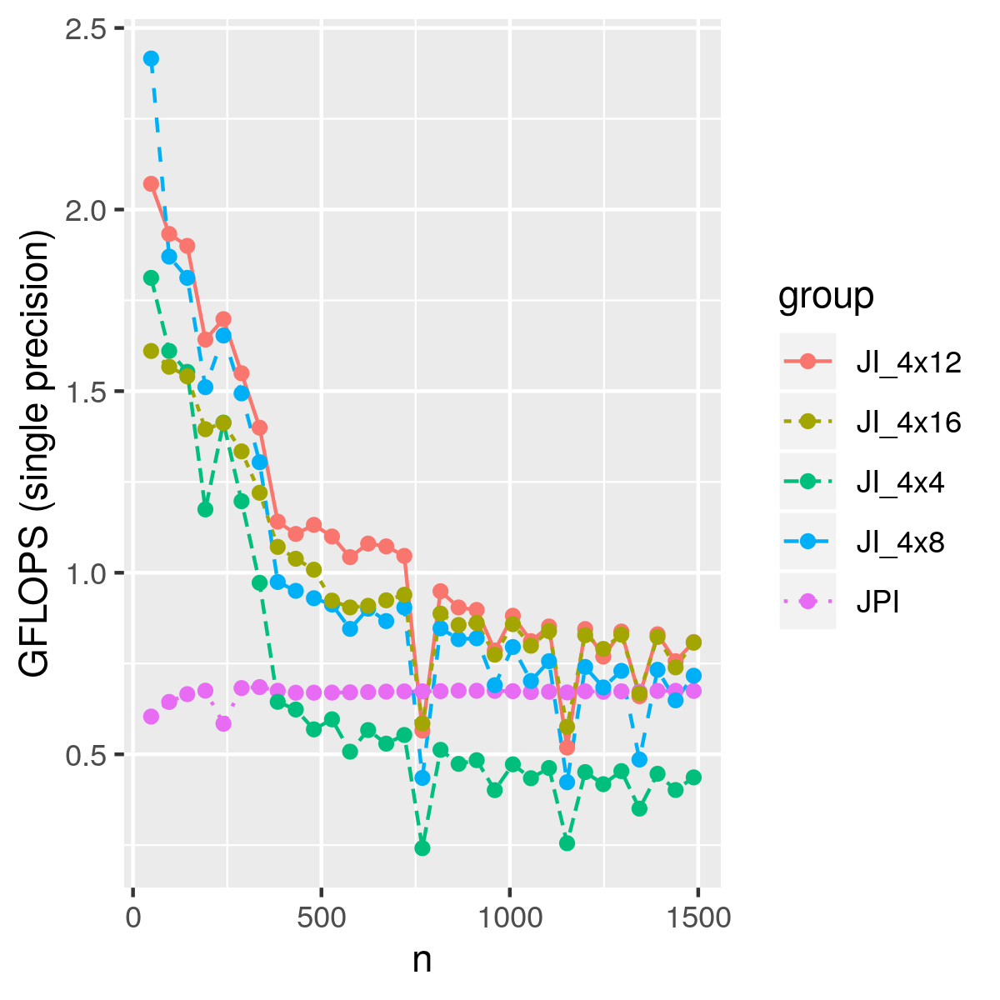
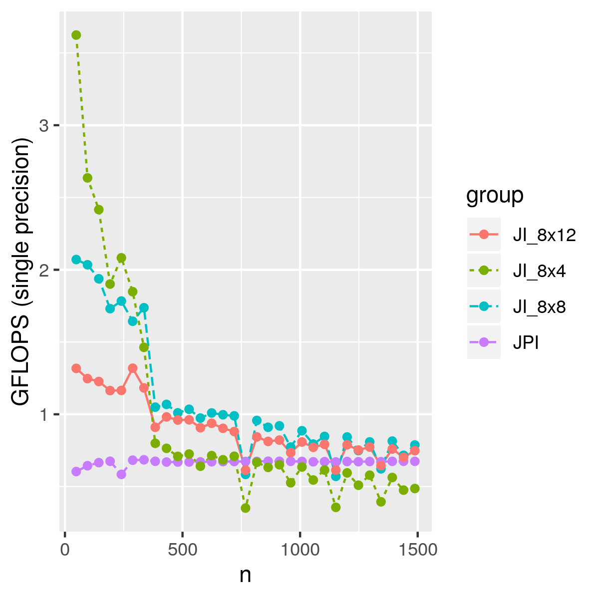
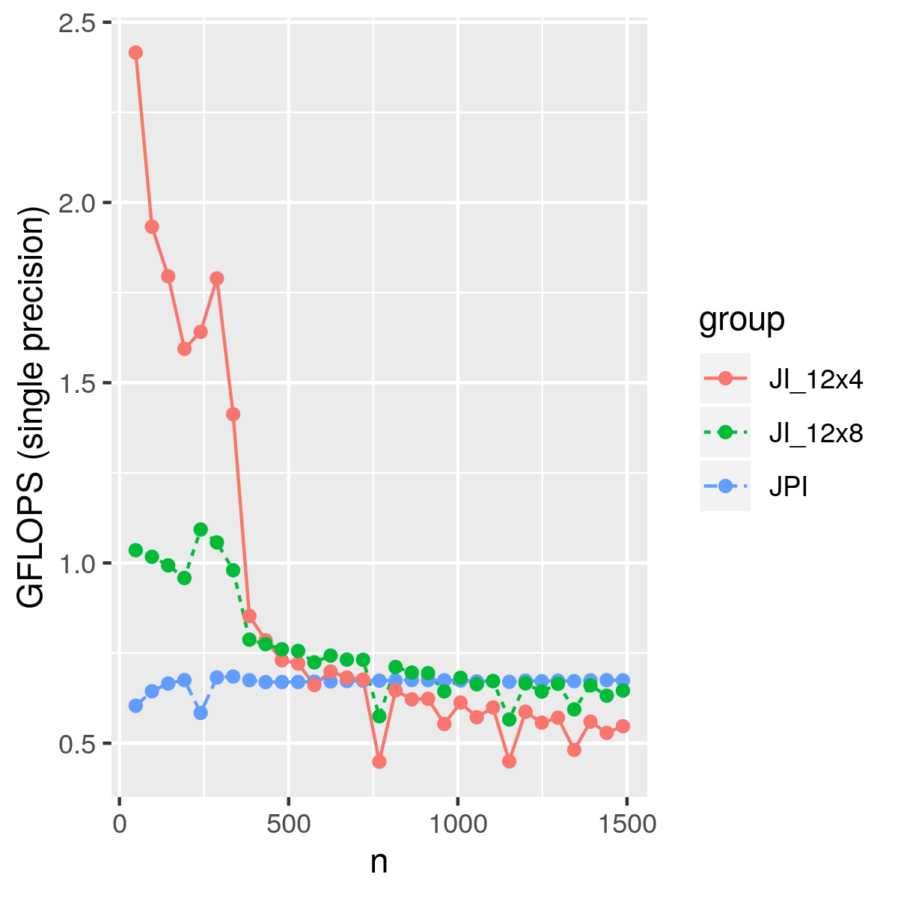

## Blocking for registers

In this part, we are using a super simple memory model. We assume there is only main memory and registers,
and we are loading blocks of A, B and C into registers as shown below:

<p></p>

As we mentioned before, the Raspberry Pi 3 has neon support,
so we are loading data into vector register. There are 4 intrinsic functions we need here:

- `vld1q_f32`: it loads a vector into register, which is very similar to `_mm256_loadu_pd` in AVX.

```cpp
float values[5] = { 1.0, 2.0, 3.0, 4.0, 5.0 };
float32x4_t v = vld1q_f32(values);
// v = { 1.0, 2.0, 3.0, 4.0 }
```

- `vld1q_dup_f32`: it loads the same value for all lanes, which is very similar to `_mm256_broadcast_sd` in AVX.

```cpp
float val = 3.0;
float32x4_t v = vld1q_dup_f32(&val);
// v = { 3.0, 3.0, 3.0, 3.0 }
```

- `vst1q_f32`: it stores the vector back into memory, which is very similar to `_mm256_storeu_pd` in AVX.

```cpp
float32x4_t v = { 1.0, 2.0, 3.0, 4.0 };
float values[4] = new float[4];
vst1q_f32(values, v);
// values = { 1.0, 2.0, 3.0, 4.0 }
```

- `vmlaq_f32`: multiply and accumulate, which is very similar to `_mm256_fmadd_pd` in AVX.

```cpp
float32x4_t v1 = {1.0, 2.0, 3.0, 4.0}, v2 = {5.0, 6.0, 7.0, 8.0}, v3 = {4.0, 3.0, 2.0, 1.0};
float32x4_t acc = vmlaq_f32(v3, v1, v2);  // acc = v3 + v1 * v2, {9.0, 15.0, 23.0, 33.0};
```

Using different block sizes, we have the performance below. For small matrices, we even achieved 3 GLOPS.
This naive blocking method only considered registers, but not cache,
which means we have plenty of room to improve.

<p></p>

<p></p>

<p></p>
