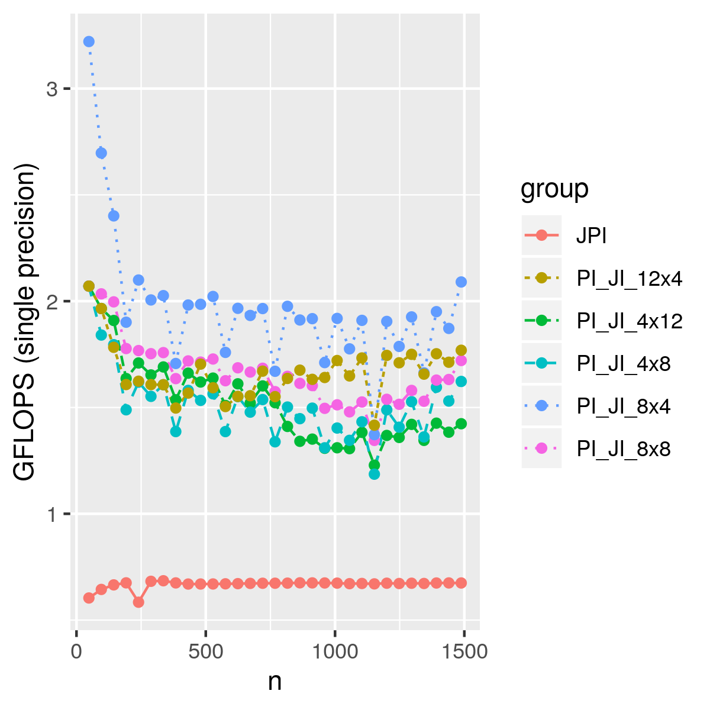
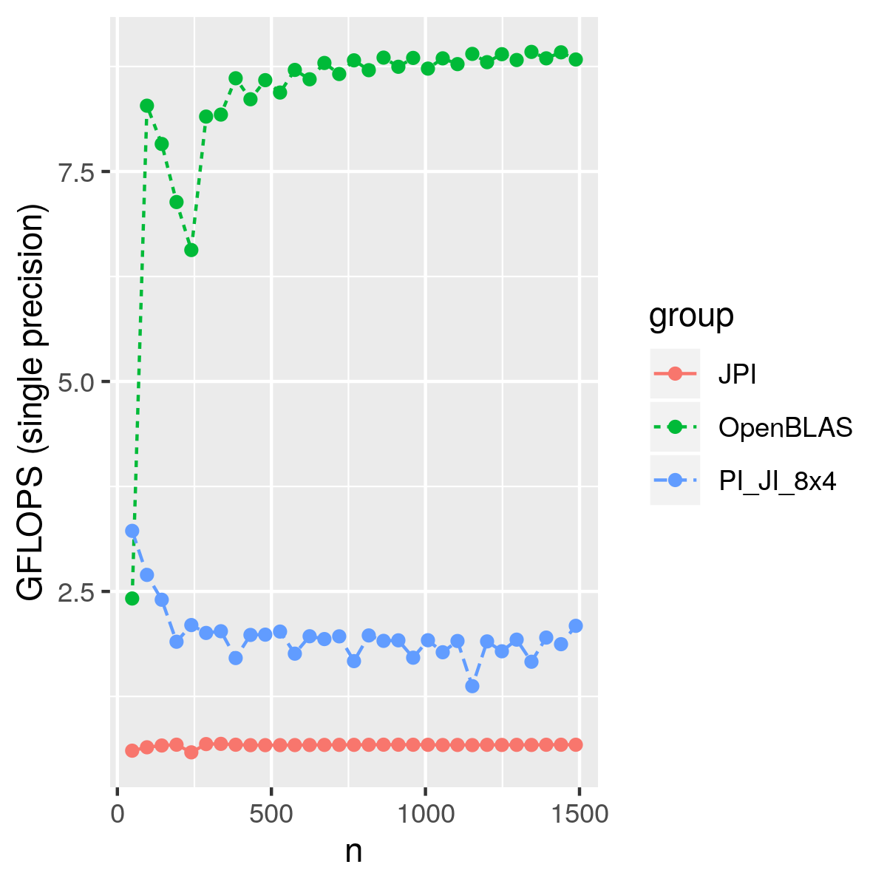

## Blocking for cache

In this part, we are using a super simple memory model with cache,
so we added an additional blocking for cache.
With the kernels we developed in part3, we also used __192*192__ blocks.

With this simple technique, we can have a gemm with around 2 GFLOPS.
We didn't optimize the cache size, which means we can potentially improve more
by changing the block size.

However, we are still far behind OpenBLAS.

