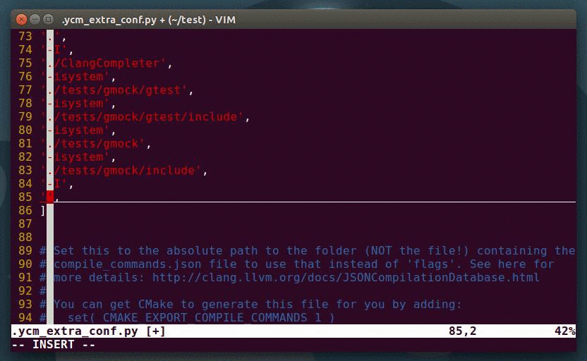
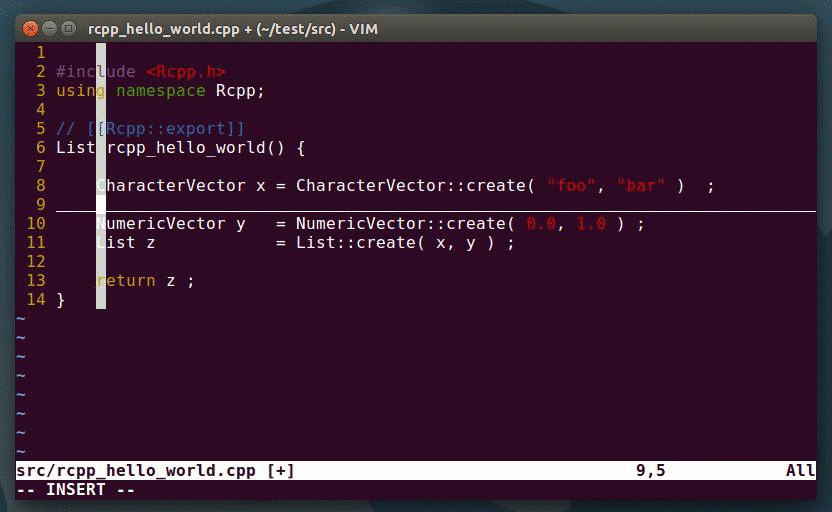
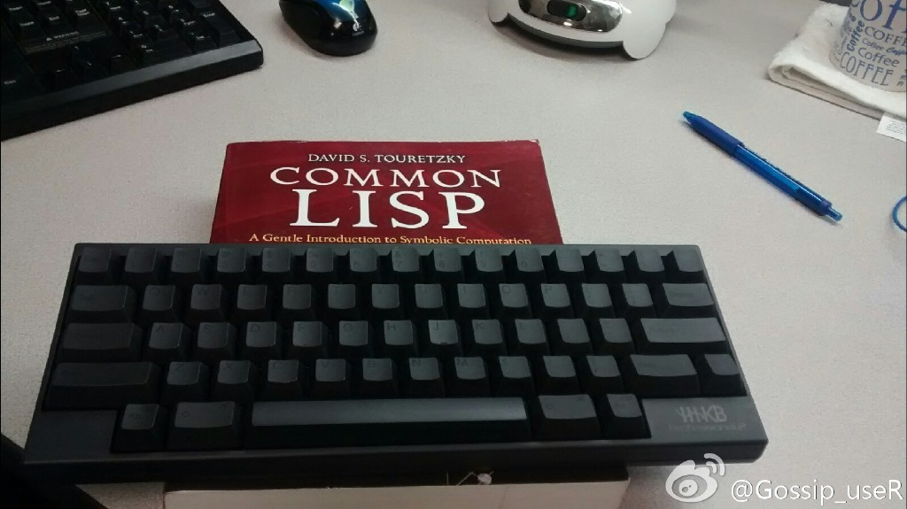
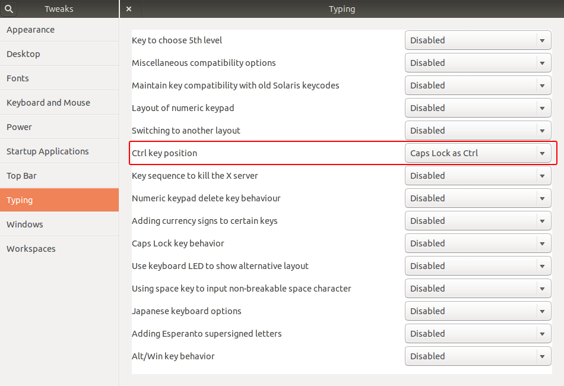

其实写这种东西是吃力不讨好的，因为每个人的口味都不同，用什么编辑器都能干一仗的嘛。

这里配置的其实是一个基于Vim的C++的开发环境，毕竟Rcpp其实是个C++项目。

特别说明两点：首先，默认是在Linux下进行配置，Mac下理论上讲没有任何问题，Windows没有试过；其次，这里用Vim的原因主要是`YouCompleteMe`这个自动补全的插件。功能足够强大，配置和使用起来又相当简单。这个是我至今用过的最复杂的Vim插件。

# 安装YouCompleteMe

R，Rcpp和Vim自然都是需要装的，其中Vim的版本请保证不低于7.4。

`YouCompleteMe`本身是python写的，请确认你已经装了`cmake`和`python-dev`。

```
$ sudo apt-get install cmake python-dev
```


最推荐的安装方法是通过`VundleVim`，这是一个Vim的插件管理器。


安装起来相当简单，跟着[README](https://github.com/VundleVim/Vundle.vim#quick-start)来就行了。先把代码clone到本地

```
$ git clone https://github.com/VundleVim/Vundle.vim.git ~/.vim/bundle/Vundle.vim
```

编辑`.vimrc`之后，打开Vim，输入`:PluginInstall`。

我把我用的[.vimrc](https://gist.github.com/thirdwing/1b736bc9345db46055a4)贴出来，实在太懒，直接用它也行。算上`YouCompleteMe`，一共就装了3个插件：`YouCompleteMe`自动补全；`nerdcommenter`代码注释，就是用`;cc`注释，用`;cu`取消注释；`vim-indent-guides`可视化缩进。关于折腾Vim，网上有足够多的资料，我就不多说了。

最后用下面的命令编译安装`YouCompleteMe`。

```
$ cd ~/.vim/bundle/YouCompleteMe
$ ./install.py --clang-completer
```

其实这就差不多了，打开C++文件时就已经有自动补全了，但是R和Rcpp的还是没有。

请在下面这个路径里找到`.ycm_extra_conf.py`这个文件。

```
~/.vim/bundle/YouCompleteMe/third_party/ycmd/cpp/ycm/.ycm_extra_conf.py
```

要自动补全R和Rcpp，需要修改这个文件。你可以直接修改它，也可以把它复制一份到每个项目的目录里再修改，也就是全局设置和每个项目单独设置的区别。

这个文件里有个数组`flags`，就是编译选项。把R和Rcpp的头文件位置添上就行了。
下面的位置是我机器上的，请自行调整。

```
/home/qkou/R/x86_64-pc-linux-gnu-library/3.2/Rcpp/include
/usr/share/R/include
```

其实这个时候已经看出来这个插件的NB之处了，文件路径都是自动补全的。

<p></p>

添加完头文件路径，打开R包里的C++文件，效果如下。

<p></p>

最后说一句，为了用快捷键方便，很多人会考虑把`Caps Lock`换成`Ctrl`。

Ubuntu下一般有两个选择：第一，买一个HHKB。在此郑重感谢送我HHKB的好基友，你再怎么跟我吐槽在耶鲁读书不爽，我都不会放弃你这个土豪朋友的。

<p></p>

第二，Tweak Tool里可以直接设置的。

<p></p>
